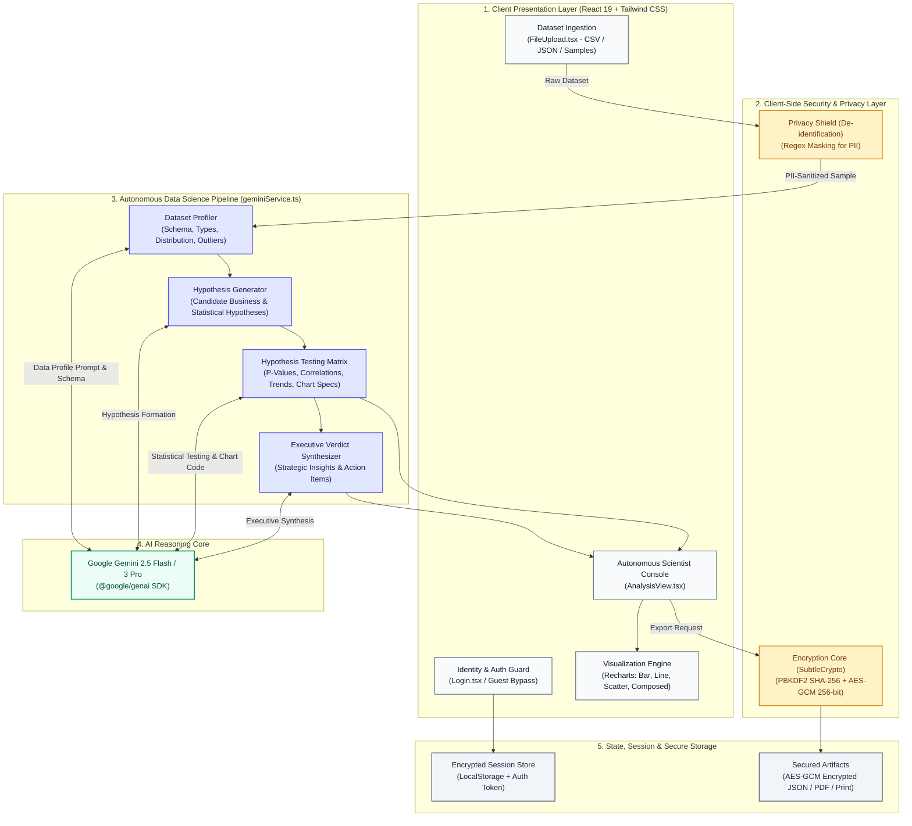

```mermaid
flowchart TD
    %% Styling Classes
    classDef client fill:#f8fafc,stroke:#64748b,stroke-width:1.5px,color:#0f172a;
    classDef security fill:#fef3c7,stroke:#d97706,stroke-width:1.5px,color:#78350f;
    classDef core fill:#e0e7ff,stroke:#4f46e5,stroke-width:1.5px,color:#1e1b4b;
    classDef ai fill:#ecfdf5,stroke:#059669,stroke-width:2px,color:#064e3b;
    classDef storage fill:#f1f5f9,stroke:#475569,stroke-width:1.5px,color:#1e293b;

    subgraph UI["1. Client Presentation Layer (React 19 + Tailwind CSS)"]
        direction TB
        Auth["Identity & Auth Guard<br/>(Login.tsx / Guest Bypass)"]:::client
        Upload["Dataset Ingestion<br/>(FileUpload.tsx - CSV / JSON / Samples)"]:::client
        Dashboard["Autonomous Scientist Console<br/>(AnalysisView.tsx)"]:::client
        Charts["Visualization Engine<br/>(Recharts: Bar, Line, Scatter, Composed)"]:::client
    end

    subgraph SecLayer["2. Client-Side Security & Privacy Layer"]
        direction TB
        PrivacyShield["Privacy Shield (De-identification)<br/>(Regex Masking for PII)"]:::security
        CryptoEngine["Encryption Core (SubtleCrypto)<br/>(PBKDF2 SHA-256 + AES-GCM 256-bit)"]:::security
    end

    subgraph Engine["3. Autonomous Data Science Pipeline (geminiService.ts)"]
        direction TB
        Profiler["Dataset Profiler<br/>(Schema, Types, Distribution, Outliers)"]:::core
        HypoGen["Hypothesis Generator<br/>(Candidate Business & Statistical Hypotheses)"]:::core
        HypoTest["Hypothesis Testing Matrix<br/>(P-Values, Correlations, Trends, Chart Specs)"]:::core
        Verdict["Executive Verdict Synthesizer<br/>(Strategic Insights & Action Items)"]:::core
    end

    subgraph LLM["4. AI Reasoning Core"]
        Gemini["Google Gemini 2.5 Flash / 3 Pro<br/>(@google/genai SDK)"]:::ai
    end

    subgraph Output["5. State, Session & Secure Storage"]
        direction TB
        Session["Encrypted Session Store<br/>(LocalStorage + Auth Token)"]:::storage
        Export["Secured Artifacts<br/>(AES-GCM Encrypted JSON / PDF / Print)"]:::storage
    end

    %% Pipeline Connections
    Auth --> Session
    Upload -->|Raw Dataset| PrivacyShield
    PrivacyShield -->|PII-Sanitized Sample| Profiler
    
    Profiler <-->|Data Profile Prompt & Schema| Gemini
    Profiler --> HypoGen
    HypoGen <-->|Hypothesis Formation| Gemini
    HypoGen --> HypoTest
    HypoTest <-->|Statistical Testing & Chart Code| Gemini
    HypoTest --> Verdict
    Verdict <-->|Executive Synthesis| Gemini

    Verdict --> Dashboard
    HypoTest --> Dashboard
    Dashboard --> Charts
    Dashboard -->|Export Request| CryptoEngine
    CryptoEngine --> Export
```
